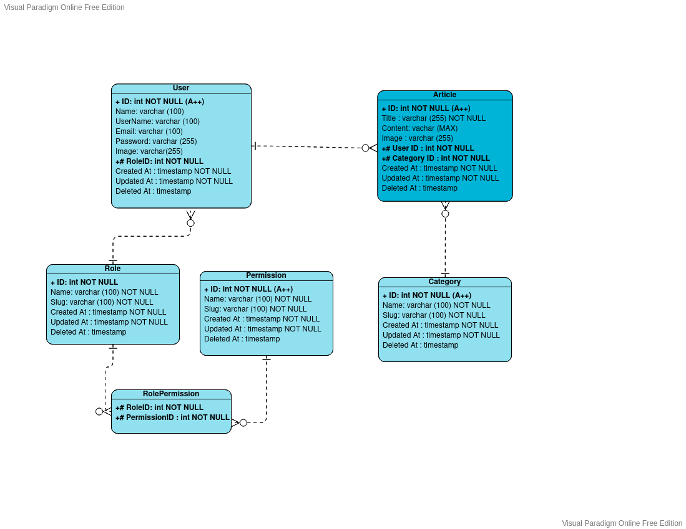

# Kishack Assessment



## Getting started

### Installing

```bash
# Clone the project and run composer
cd kishack-assesment

# Install laravel dependencies
composer install

# copy .env.example to .env
cp .env.example .env

# Migration and DB seeder (after changing your DB settings in .env)
php artisan migrate --seed

# Install dependency with NPM
npm install

# develop
npm run dev

# Build on production
npm run production

# Run Backend
php artisan serve
```

Open http://localhost:8000 to access kishack-assesment
